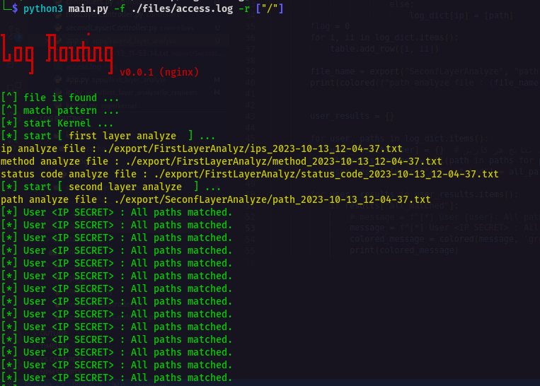

# logRouting



This is a portable project capable of analyzing logs at three levels. You can provide a web service log file to this software and expect to receive results from a log analyzer. Additionally, you can check if your users are following the steps correctly by providing a route map or not.

```bash
git clone https://github.com/localho3t/logRouting.git
cd logRouting
pip install -r requirements.txt
python3 main.py
```

## License

The logRouting software licensed under the [MIT license](https://opensource.org/licenses/MIT).

# enjoy ;)

[localho3t]
